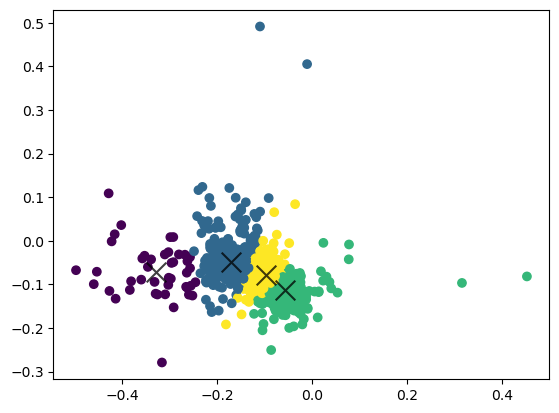

# Corporate Sector Clustering
## Unsupervised Machine Learning with k-Means Clustering

Given the financial performance of the corporations, can we group the corporations into different sectors? 
This project is interested in creating clusters of corporations within the credit rating data set. Assuming 
that corporations within the same sector of the economy tend to have similar liquidity levels, profitability levels, debt levels, operations conditions, and cash
flow properties, I'm interested in the number of sectors represented in the given data set.

I created 2D exploratory data visualization of the original data using PCA dimension reduction. Then, I implemented the self-coded k-means and 
the k-means algorithm from the sklearn package. I compared the run time and peak memory usage of the two algorithms and determine the optimal number of clusters 
using an elbowology comparison of the goodness of the clusters. The results showed that 4 is the optimal number of clusters within the data set, meaning that 
the corporations within the data set can be separated into 4 sectors. This also aligns with the convention of separating our economy into the primary, secondary, 
tertiary, and quarternary sectors. In terms of the comparison between the two k-means implementations, the self-coded k-means is faster in terms of a smaller number of clusters
 but takes significantly more time as the number of clusters increases. The sklearn k-means algorithm seems to have a steady run time increase as the number of clusters increases.
Both algorithms have similar peak memory usage.

For a complete walk-through of this project, please refer to `Corporate Sector Clustering.ipynb`.